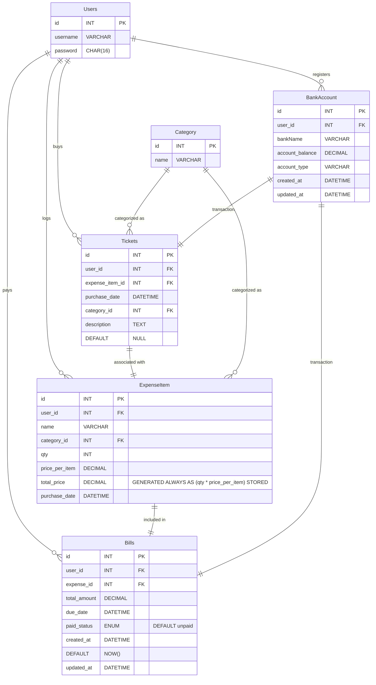

# Design Document

By YOUR NAME HERE

Video overview: <URL HERE>
## Purpose
Nowadays, with the rise of the economic crisis most of people aim to manage their life in the purpose of saving more and spend less. 
So it crossed our mind to find a database model that can help ourselves or maybe the world to read better our behavior in a daily basis so as not to fall in dependencie,
but at least helping to reach the economy indenpendancy. I already know that that some applications exists about this matter and I'm sure I won't be revolutionnary but this application will fit the needs to my family and me. Thus I'll be focusing this project on smaller part and scaling it up step by step until reaching the good balance of efficiency and data schema.
## Scope

In this section you should answer the following questions:

* What is the purpose of your database? - refer to mermaid

* Which people, places, things, etc. are you including in the scope of your database?
- Scope of Access :
    - 
- Scopes of Transactions :
- Scope of queries :
- Sscope of variables and procedures : 
- Scope of data Integrity Constraints :
- scope of Backup and Recovery :
* Which people, places, things, etc. are *outside* the scope of your database?

## Functional Requirements

In this section you should answer the following questions:

* What should a user be able to do with your database?
* What's beyond the scope of what a user should be able to do with your database?

## Representation

### Entities

In this section you should answer the following questions:

* Which entities will you choose to represent in your database?
* What attributes will those entities have?
* Why did you choose the types you did?
* Why did you choose the constraints you did?

### Relationships

In this section you should include your entity relationship diagram and describe the relationships between the entities in your database.

## Optimizations

In this section you should answer the following questions:

* Which optimizations (e.g., indexes, views) did you create? Why?

## Limitations

In this section you should answer the following questions:

* What are the limitations of your design?
* What might your database not be able to represent very well?
